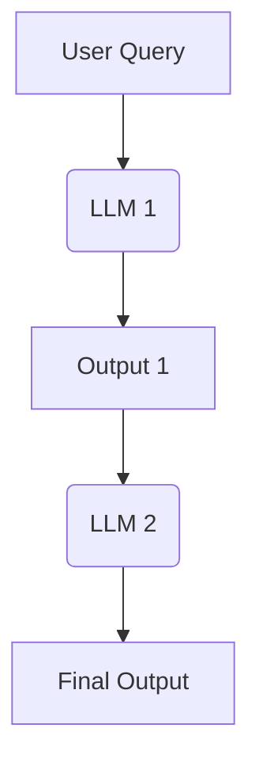
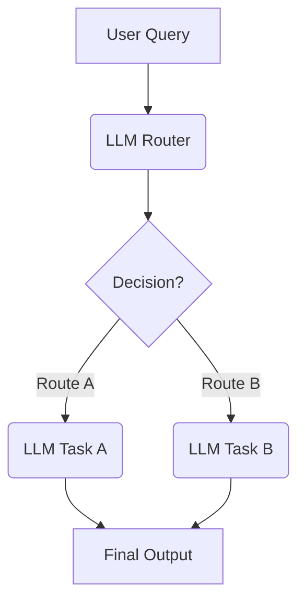
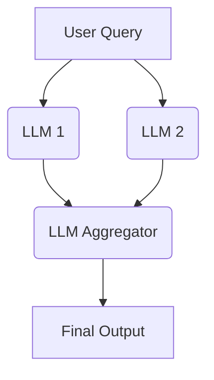
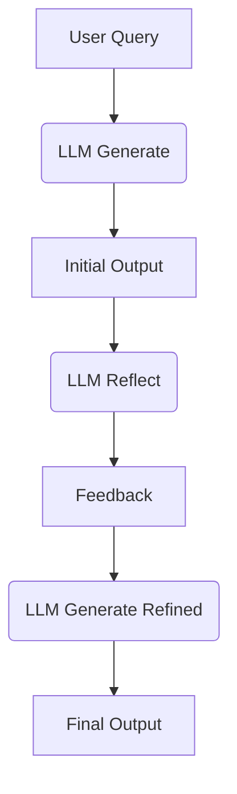
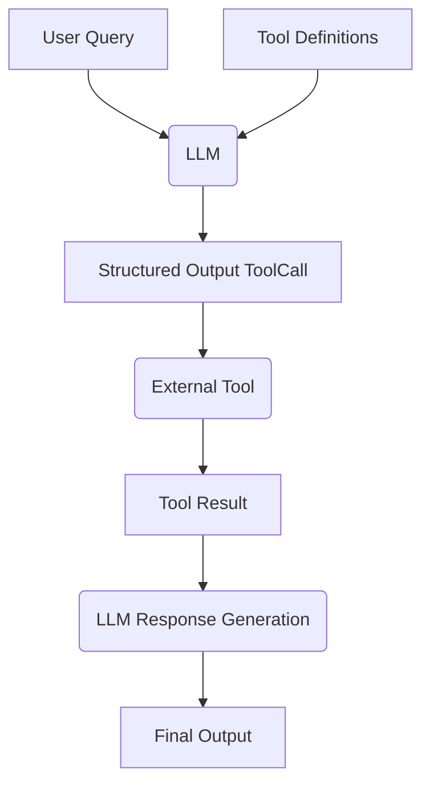
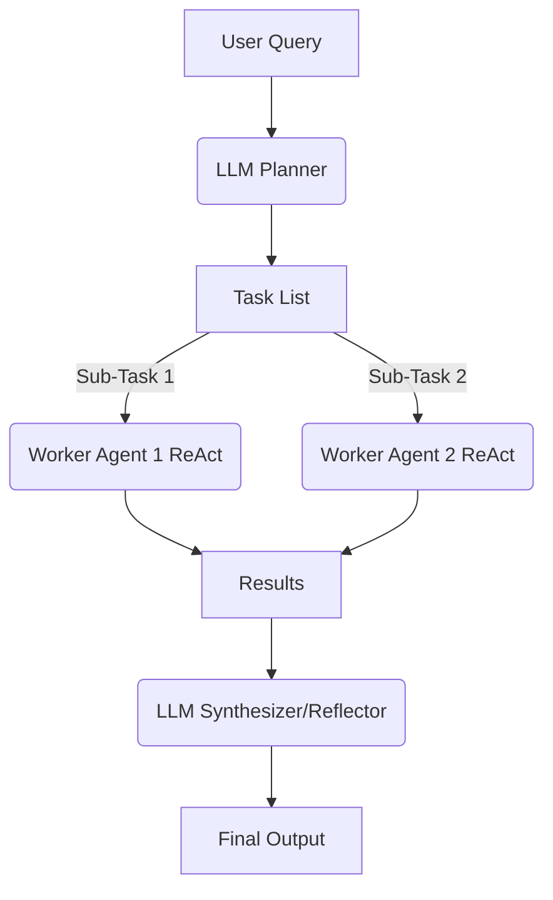
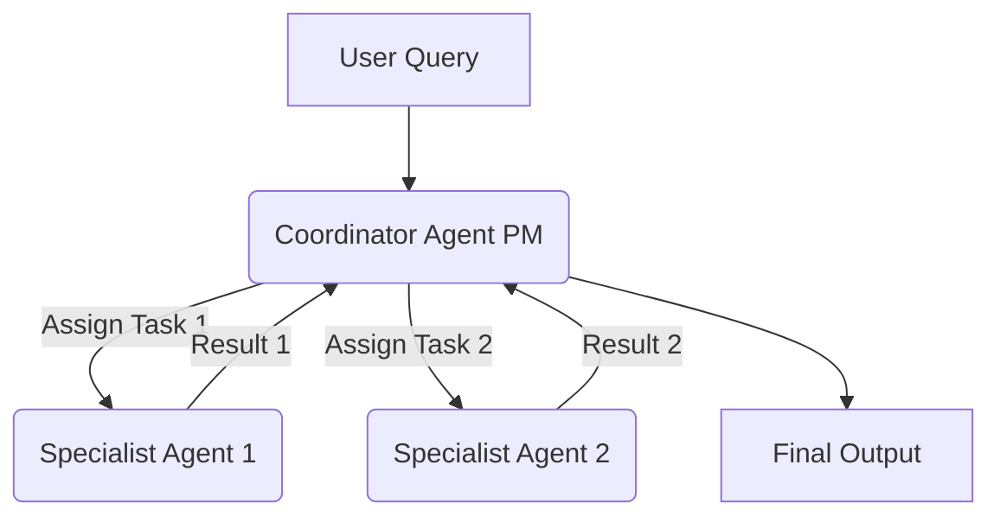

# Zero to One: Learning Agentic Patterns

AI agents. Agentic AI. Agentic architectures. Agentic workflows. Agentic patterns. Agents are everywhere. But what exactly *are* they, and how do we build robust and effective agentic systems? While the term "agent" is used broadly, a key characteristic is their ability to dynamically plan and execute tasks, often leveraging external tools and memory to achieve complex goals.

This post aims to explore common design patterns. Think of these patterns as blueprints or reusable templates for building AI applications. Understanding them provides a mental model for tackling complex problems and designing systems that are scalable, modular, and adaptable.

We'll dive into several common patterns, differentiating between more structured **workflows** and more dynamic **agentic patterns**. Workflows typically follow predefined paths, while agents have more autonomy in deciding their course of action.

**Why Do (Agentic) Patterns Matter?**

*   Patterns provide a structured way to think and design systems.
*   Patterns allow us to build and grow AI applications in complexity and adapt to changing requirements. Modular designs based on patterns are easier to modify and extend.
*   Patterns help manage the complexity of coordinating multiple agents, tools, and workflows by offering proven, reusable templates. They promote best practices and shared understanding among developers.

**When (and When Not) to Use Agents?**

Before diving into patterns, it's crucial to consider *when* an agentic approach is truly necessary.

*   Always seek the simplest solution first. If you know the exact steps required to solve a problem, a fixed workflow or even a simple script might be more efficient and reliable than a agent.
*   Agentic systems often trade increased latency and computational cost for potentially better performance on complex, ambiguous, or dynamic tasks. Be sure the benefits outweigh these costs.
*   Use **workflows** for predictability and consistency when dealing with well-defined tasks where the steps are known. 
*   Use **agents** when flexibility, adaptability, and model-driven decision-making are needed.
*   Keep it Simple (Still): Even when building agentic systems, strive for the simplest effective design. Overly complex agent can become difficult to debug and manage.
*   Agency introduces inherent unpredictability and potential errors. Agentic systems must incorporate robust error logging, exception handling, and retry mechanisms, allowing the system (or the underlying LLM) a chance to self-correct.

Below, we'll explore 3 common workflow patterns and 4 agentic patterns. We'll illustrate each using pure API calls, without relying on specific frameworks like LangChain, LangGraph, LlamaIndex, or CrewAI, to focus on the core concepts.

## Pattern Overview

We will cover the following patterns:

- [Zero to One: Learning Agentic Patterns](#zero-to-one-learning-agentic-patterns)
  - [Pattern Overview](#pattern-overview)
  - [Workflow: Prompt Chaining](#workflow-prompt-chaining)
  - [Workflow: Routing or Handoff](#workflow-routing-or-handoff)
  - [Workflow: Parallelization](#workflow-parallelization)
  - [Reflection Pattern](#reflection-pattern)
  - [Tool Use Pattern](#tool-use-pattern)
  - [Planning Pattern (Orchestrator-Workers)](#planning-pattern-orchestrator-workers)
  - [Multi-Agent Pattern](#multi-agent-pattern)
  - [Combining and Customizing These Patterns](#combining-and-customizing-these-patterns)
  - [Resources:](#resources)

## Workflow: Prompt Chaining

The output of one LLM call sequentially feeds into the input of the next LLM call. This pattern decomposes a task into a fixed sequence of steps. Each step is handled by an LLM call that processes the output from the preceding one. It's suitable for tasks that can be cleanly broken down into predictable, sequential subtasks. 

Use Cases:
*   Generating a structured document: LLM 1 creates an outline, LLM 2 validates the outline against criteria, LLM 3 writes the content based on the validated outline.
*   Multi-step data processing: Extracting information, transforming it, and then summarizing it.
*   Generating newsletters based on curated inputs.

## Workflow: Routing or Handoff

An initial LLM acts as a router, classifying the user's input and directing it to the most appropriate specialized task or LLM. This pattern implements a separation of concerns and allows for optimizing individual downstream tasks (using specialized prompts, different models, or specific tools) in isolation. It improves efficiency and potentially reduces costs by using smaller models for simpler tasks. When a task is routed, the selected agent "takes over" responsibility for completion.

Use Cases:
*   Customer support systems: Routing queries to agents specialized in billing, technical support, or product information.
*   Tiered LLM usage: Routing simple queries to faster, cheaper models (like Llama 3.1 8B) and complex or unusual questions to more capable models (like Gemini 1.5 Pro).
*   Content generation: Routing requests for blog posts, social media updates, or ad copy to different specialized prompts/models.

## Workflow: Parallelization

A task is broken down into independent subtasks that are processed simultaneously by multiple LLMs, with their outputs being aggregated. This pattern uses concurrency for tasks. The initial query (or parts of it) is sent to multiple LLMs in parallel with individual prompts/goals. Once all branches are complete, their individual results are collected and passed to a final aggregator LLM, which synthesizes them into the final response. This can improve latency if subtasks don't depend on each other, or enhance quality through techniques like majority voting or generating diverse options.

Use Cases:
*   RAG with query decomposition: Breaking a complex query into sub-queries, running retrievals for each in parallel, and synthesizing the results.
*   Analyzing large documents: Dividing the document into sections, summarizing each section in parallel, and then combining the summaries.
*   Generating multiple perspectives: Asking multiple LLMs the same question with different persona prompts and aggregating their responses.
*   Map-reduce style operations on data.

## Reflection Pattern

An agent evaluates its own output and uses that feedback to refine its response iteratively. This pattern is also known as Evaluator-Optimizer and uses a self-correction loop. An initial LLM generates a response or completes a task. A second LLM step (or even the same LLM with a different prompt) then acts as a reflector or evaluator, critiquing the initial output against the requirements or desired quality. This critique (feedback) is then fed back, prompting the LLM to produce a refined output. This cycle can repeat until the evaluator confirms the requirements are met or a satisfing output is achieved.

Use Cases:
*   Code generation: Writing code, executing it, using error messages or test results as feedback to fix bugs.
*   Writing and refinement: Generating a draft, reflecting on its clarity and tone, and then revising it.
*   Complex problem solving: Generating a plan, evaluating its feasibility, and refining it based on the evaluation.
*   Information retrieval: Searching for information and using an evaluator LLM to check if all required details were found before presenting the answer.

## Tool Use Pattern

LLM has the ability to invoke external functions or APIs to interact with the outside world, retrieve information, or perform actions. This pattern often referred to as Function Calling and is the most widely recognized pattern. The LLM is provided with definitions (name, description, input schema) of available tools (functions, APIs, databases, etc.). Based on the user query, the LLM can decide to call one or more tools by generating a structured output (like JSON) matching the required schema. This output is used to execute the actual external tool/function, and the result is returned to the LLM. The LLM then uses this result to formulate its final response to the user. This vastly extends the LLM's capabilities beyond its training data.

Use Cases:
*   Booking appointments using a calendar API.
*   Retrieving real-time stock prices via a financial API.
*   Searching a vector database for relevant documents (RAG).
*   Controlling smart home devices.
*   Executing code snippets.

**A Note on ReAct**

The ReAct (Reasoning and Acting) architecture builds upon the Tool Use and Reflection patterns. It typically involves an LLM operating within a loop. In each iteration, the LLM **reasons** about the task, **acts** by deciding which tool to use (or if it should respond to the user), executes the tool call, observes the result, and then loops back to reason again based on the new information. The ReAct pattern was mostly replaced by the tool use pattern as it yielded better results and was more reliable, but it's still a good pattern to know about.

## Planning Pattern (Orchestrator-Workers)

A central planner LLM breaks down a complex task into a dynamic list of subtasks, which are then delegated to specialized worker agents (often using Tool Use) for execution. This pattern tries to solve complex problems requiring multi-step reasoning by creating an intial Plan. This plan is dynamically generated based on the user input. Subtasks are then assigned to "Worker" agents that execute them, potentially in parallel if dependencies allow. An "Orchestrator" or "Synthesizer" LLM collects the results from the workers, reflects on whether the overall goal has been achieved, and either synthesizes the final output or potentially initiates a re-planning step if necessary. This reduces the cognitive load on any single LLM call, improves reasoning quality, minimizes errors, and allows for dynamic adaptation of the workflow. The key difference from Routing is that the Planner generates a *multi-step plan* rather than selecting a single next step.

Use Cases:
*   Complex software development tasks: Breaking down "build a feature" into planning, coding, testing, and documentation subtasks.
*   Research and report generation: Planning steps like literature search, data extraction, analysis, and report writing.
*   Multi-modal tasks: Planning steps involving image generation, text analysis, and data integration.
*   Executing complex user requests like "Plan a 3-day trip to Paris, book flights and a hotel within my budget."

## Multi-Agent Pattern

Multiple distinct agents each assigned a specific role, persona, or expertise collaborate to achieve a common goal. This pattern uses autonomous or semi-autonomous agents. Each agent might have a unique role (e.g., Project Manager, Coder, Tester, Critic), specialized knowledge, or access to specific tools. They interact and collaborate, often coordinated by a central "coordinator" or "manager" agent (like the PM in the diagram), delegating tasks and sharing information to collectively solve a problem that might be too complex for a single agent. This simulates real-world team dynamics and allows for highly specialized contributions.

Use Cases:
*   Simulating debates or brainstorming sessions with different AI personas.
*   Complex software creation involving agents for planning, coding, testing, and deployment.
*   Running virtual experiments or simulations with agents representing different actors.
*   Collaborative writing or content creation processes.

## Combining and Customizing These Patterns

It's important to remember that these patterns aren't fixed rules but flexible building blocks. Real-world agentic systems often combine elements from multiple patterns. A Planning agent might use Tool Use, and its workers could employ Reflection. A Multi-Agent system might use Routing internally for task assignment.

The key to success with any LLM application, especially complex agentic systems, is empirical evaluation. Define metrics, measure performance, identify bottlenecks or failure points, and iterate on your design. Resist to over-engineer.

## Resources:

Resources used to create this post:
*   [5 Agentic AI Design Patterns](https://blog.dailydoseofds.com/p/5-agentic-ai-design-patterns)
*   [What are Agentic Workflows?](https://weaviate.io/blog/what-are-agentic-workflows)
*   [Building effective agents](https://www.anthropic.com/engineering/building-effective-agents)
*   [How Agents Can Improve LLM Performance](https://www.deeplearning.ai/the-batch/how-agents-can-improve-llm-performance)
*   [Agentic Design Patterns](https://medium.com/@bijit211987/agentic-design-patterns-cbd0aae2962f)
*   [Agent Recipes](https://www.agentrecipes.com/)
*   [Smol Agents Docs](https://huggingface.co/docs/smolagents/index)
*   [LangGraph Agentic Concepts](https://langchain-ai.github.io/langgraph/concepts/agentic_concepts/)
*   [OpenAI Agents Python Examples](https://github.com/openai/openai-agents-python/tree/main/examples/agent_patterns)
*   [Anthropic Cookbook: Basic Workflows](https://github.com/anthropics/anthropic-cookbook/blob/main/patterns/agents/basic_workflows.ipynb)
*   [Anthropic Cookbook: Reflection (Evaluator-Optimizer)](https://github.com/anthropics/anthropic-cookbook/blob/main/patterns/agents/evaluator_optimizer.ipynb)
*   [Anthropic Cookbook: Planning (Orchestrator-Workers)](https://github.com/anthropics/anthropic-cookbook/blob/main/patterns/agents/orchestrator_workers.ipynb)
*   [OpenAI Example: Tool Use (Agents as Tools)](https://github.com/openai/openai-agents-python/blob/main/examples/agent_patterns/agents_as_tools.py)
*   [OpenAI Example: Chaining + Reflection (Deterministic)](https://github.com/openai/openai-agents-python/blob/main/examples/agent_patterns/deterministic.py)
*   [OpenAI Example: Reflection (LLM as Judge)](https://github.com/openai/openai-agents-python/blob/main/examples/agent_patterns/llm_as_a_judge.py)
*   [OpenAI Example: Parallelization](https://github.com/openai/openai-agents-python/blob/main/examples/agent_patterns/parallelization.py)
*   [Anthropic Cookbook: Utility Functions](https://github.com/anthropics/anthropic-cookbook/blob/main/patterns/agents/util.py)
*   [Agentic Patterns Course Repo](https://github.com/neural-maze/agentic-patterns-course?tab=readme-ov-file#multiagent-pattern-)