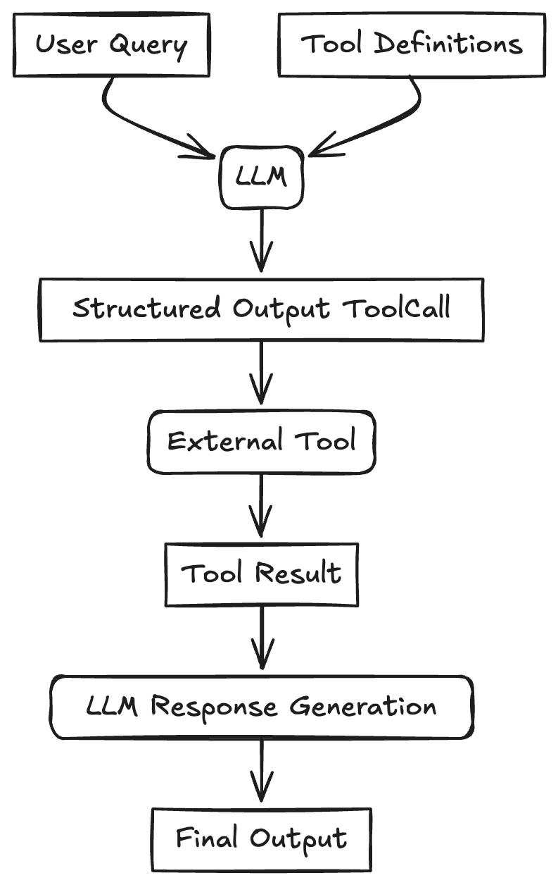
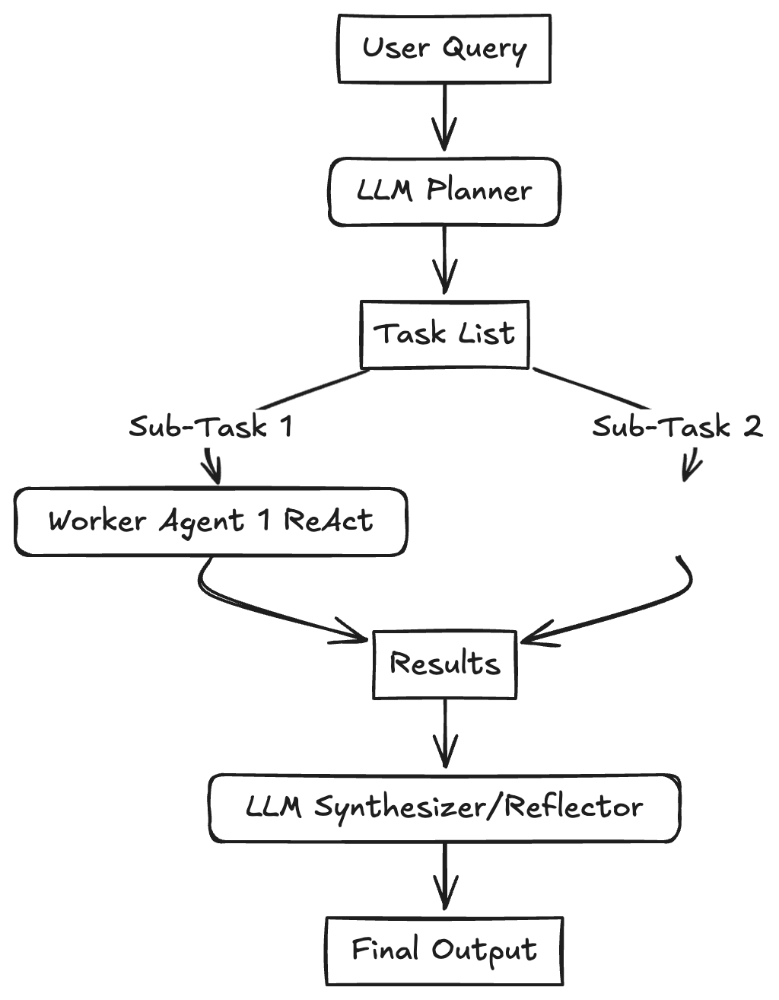

# Zero to One: Learning Agentic Patterns

AI agents. Agentic AI. Agentic architectures. Agentic workflows. Agentic patterns. Agents are everywhere. But what exactly *are* they, and how do we build robust and effective agentic systems? While the term "agent" is used broadly, a key characteristic is their ability to dynamically plan and execute tasks, often leveraging external tools and memory to achieve complex goals.

This post aims to explore common design patterns. Think of these patterns as blueprints or reusable templates for building AI applications. Understanding them provides a mental model for tackling complex problems and designing systems that are scalable, modular, and adaptable.

We'll dive into several common patterns, differentiating between more structured **workflows** and more dynamic **agentic patterns**. Workflows typically follow predefined paths, while agents have more autonomy in deciding their course of action.

**Why Do (Agentic) Patterns Matter?**

*   Patterns provide a structured way to think and design systems.
*   Patterns allow us to build and grow AI applications in complexity and adapt to changing requirements. Modular designs based on patterns are easier to modify and extend.
*   Patterns help manage the complexity of coordinating multiple agents, tools, and workflows by offering proven, reusable templates. They promote best practices and shared understanding among developers.

**When (and When Not) to Use Agents?**

Before diving into patterns, it's crucial to consider *when* an agentic approach is truly necessary.

*   Always seek the simplest solution first. If you know the exact steps required to solve a problem, a fixed workflow or even a simple script might be more efficient and reliable than a agent.
*   Agentic systems often trade increased latency and computational cost for potentially better performance on complex, ambiguous, or dynamic tasks. Be sure the benefits outweigh these costs.
*   Use **workflows** for predictability and consistency when dealing with well-defined tasks where the steps are known. 
*   Use **agents** when flexibility, adaptability, and model-driven decision-making are needed.
*   Keep it Simple (Still): Even when building agentic systems, strive for the simplest effective design. Overly complex agent can become difficult to debug and manage.
*   Agency introduces inherent unpredictability and potential errors. Agentic systems must incorporate robust error logging, exception handling, and retry mechanisms, allowing the system (or the underlying LLM) a chance to self-correct.

Below, we'll explore 3 common workflow patterns and 4 agentic patterns. We'll illustrate each using pure API calls, without relying on specific frameworks like LangChain, LangGraph, LlamaIndex, or CrewAI, to focus on the core concepts.

## Pattern Overview

We will cover the following patterns:
- [Zero to One: Learning Agentic Patterns](#zero-to-one-learning-agentic-patterns)
  - [Pattern Overview](#pattern-overview)
  - [Workflow: Prompt Chaining](#workflow-prompt-chaining)
  - [Workflow: Routing or Handoff](#workflow-routing-or-handoff)
  - [Workflow: Parallelization](#workflow-parallelization)
  - [Reflection Pattern](#reflection-pattern)
  - [Tool Use Pattern](#tool-use-pattern)
  - [Planning Pattern (Orchestrator-Workers)](#planning-pattern-orchestrator-workers)
  - [Multi-Agent Pattern](#multi-agent-pattern)
  - [Combining and Customizing These Patterns](#combining-and-customizing-these-patterns)
  - [Resources:](#resources)

## Workflow: Prompt Chaining

<div style="display: flex; justify-content: center;">

</div>


The output of one LLM call sequentially feeds into the input of the next LLM call. This pattern decomposes a task into a fixed sequence of steps. Each step is handled by an LLM call that processes the output from the preceding one. It's suitable for tasks that can be cleanly broken down into predictable, sequential subtasks. 

Use Cases:
*   Generating a structured document: LLM 1 creates an outline, LLM 2 validates the outline against criteria, LLM 3 writes the content based on the validated outline.
*   Multi-step data processing: Extracting information, transforming it, and then summarizing it.
*   Generating newsletters based on curated inputs.


```python
import os
from google import genai

# Configure the client (ensure GEMINI_API_KEY is set in your environment)
client = genai.Client(api_key=os.environ["GEMINI_API_KEY"])

# --- Step 1: Summarize Text ---
original_text = "Large language models are powerful AI systems trained on vast amounts of text data. They can generate human-like text, translate languages, write different kinds of creative content, and answer your questions in an informative way."
prompt1 = f"Summarize the following text in one sentence: {original_text}"

# Use client.models.generate_content
response1 = client.models.generate_content(
    model='gemini-2.0-flash',
    contents=prompt1
)
summary = response1.text.strip()
print(f"Summary: {summary}")

# --- Step 2: Translate the Summary ---
prompt2 = f"Translate the following summary into French, only return the translation, no other text: {summary}"

# Use client.models.generate_content
response2 = client.models.generate_content(
    model='gemini-2.0-flash',
    contents=prompt2
)
translation = response2.text.strip()
print(f"Translation: {translation}")

```

    Summary: Large language models are AI systems trained on massive datasets to generate human-like text, translate languages, create content, and provide informative answers.
    Translation: Les grands modèles linguistiques sont des systèmes d'IA entraînés sur des ensembles de données massifs pour générer du texte de type humain, traduire des langues, créer du contenu et fournir des réponses informatives.


## Workflow: Routing

<div style="display: flex; justify-content: center;">

</div>


An initial LLM acts as a router, classifying the user's input and directing it to the most appropriate specialized task or LLM. This pattern implements a separation of concerns and allows for optimizing individual downstream tasks (using specialized prompts, different models, or specific tools) in isolation. It improves efficiency and potentially reduces costs by using smaller models for simpler tasks. When a task is routed, the selected agent "takes over" responsibility for completion.

Use Cases:
*   Customer support systems: Routing queries to agents specialized in billing, technical support, or product information.
*   Tiered LLM usage: Routing simple queries to faster, cheaper models (like Llama 3.1 8B) and complex or unusual questions to more capable models (like Gemini 1.5 Pro).
*   Content generation: Routing requests for blog posts, social media updates, or ad copy to different specialized prompts/models.


```python
import os
import json
from google import genai
from pydantic import BaseModel
import enum

# Configure the client (ensure GEMINI_API_KEY is set in your environment)
client = genai.Client(api_key=os.environ["GEMINI_API_KEY"])

# Define Routing Schema
class Category(enum.Enum):
    WEATHER = "weather"
    SCIENCE = "science"
    UNKNOWN = "unknown"

class RoutingDecision(BaseModel):
    category: Category
    reasoning: str

# Step 1: Route the Query
user_query = "What's the weather like in Paris?"
# user_query = "Explain quantum physics simply."
# user_query = "What is the capital of France?"

prompt_router = f"""
Analyze the user query below and determine its category.
Categories:
- weather: For questions about weather conditions.
- science: For questions about science.
- unknown: If the category is unclear.

Query: {user_query}
"""

# Use client.models.generate_content with config for structured output
response_router = client.models.generate_content(
    model= 'gemini-2.0-flash-lite',
    contents=prompt_router,
    config={
        'response_mime_type': 'application/json',
        'response_schema': RoutingDecision,
    },
)
print(f"Routing Decision: Category={response_router.parsed.category}, Reasoning={response_router.parsed.reasoning}")

# Step 2: Handoff based on Routing
final_response = ""
if response_router.parsed.category == Category.WEATHER:
    weather_prompt = f"Provide a brief weather forecast for the location mentioned in: '{user_query}'"
    weather_response = client.models.generate_content(
        model='gemini-2.0-flash',
        contents=weather_prompt
    )
    final_response = weather_response.text
elif response_router.parsed.category == Category.SCIENCE:
    science_response = client.models.generate_content(
        model="gemini-2.5-flash-preview-04-17",
        contents=user_query
    )
    final_response = science_response.text
else:
    unknown_response = client.models.generate_content(
        model="gemini-2.0-flash-lite",
        contents=f"The user query is: {prompt_router}, but could not be answered. Here is the reasoning: {response_router.parsed.reasoning}. Write a helpful response to the user for him to try again."
    )
    final_response = unknown_response.text
print(f"\nFinal Response: {final_response}")

```

    Routing Decision: Category=Category.WEATHER, Reasoning=The query asks about the weather conditions in a specific location.
    
    Final Response: Okay, given that the question is "What's the weather like in Paris?", the weather forecast would be for **Paris, France.**
    
    Here's a brief forecast:
    
    **Paris is expected to have [Insert a realistic forecast here, e.g., partly cloudy skies with a high of 22 degrees Celsius (72 degrees Fahrenheit) and a low of 14 degrees Celsius (57 degrees Fahrenheit). There is a slight chance of showers in the afternoon].**
    


## Workflow: Parallelization

<div style="display: flex; justify-content: center;">
 
</div>


A task is broken down into independent subtasks that are processed simultaneously by multiple LLMs, with their outputs being aggregated. This pattern uses concurrency for tasks. The initial query (or parts of it) is sent to multiple LLMs in parallel with individual prompts/goals. Once all branches are complete, their individual results are collected and passed to a final aggregator LLM, which synthesizes them into the final response. This can improve latency if subtasks don't depend on each other, or enhance quality through techniques like majority voting or generating diverse options.

Use Cases:
*   RAG with query decomposition: Breaking a complex query into sub-queries, running retrievals for each in parallel, and synthesizing the results.
*   Analyzing large documents: Dividing the document into sections, summarizing each section in parallel, and then combining the summaries.
*   Generating multiple perspectives: Asking multiple LLMs the same question with different persona prompts and aggregating their responses.
*   Map-reduce style operations on data.


```python
import os
import asyncio
import time
from google import genai

# Configure the client (ensure GEMINI_API_KEY is set in your environment)
client = genai.Client(api_key=os.environ["GEMINI_API_KEY"])

async def generate_content(prompt: str) -> str:
        response = await client.aio.models.generate_content(
            model="gemini-2.0-flash",
            contents=prompt
        )
        return response.text.strip()

async def parallel_tasks():
    # Define Parallel Tasks
    topic = "a friendly robot exploring a jungle"
    prompts = [
        f"Write a short, adventurous story idea about {topic}.",
        f"Write a short, funny story idea about {topic}.",
        f"Write a short, mysterious story idea about {topic}."
    ]
    # Run tasks concurrently and gather results
    start_time = time.time()
    tasks = [generate_content(prompt) for prompt in prompts]
    results = await asyncio.gather(*tasks)
    end_time = time.time()
    print(f"Time taken: {end_time - start_time} seconds")

    print("\n--- Individual Results ---")
    for i, result in enumerate(results):
        print(f"Result {i+1}: {result}\n")

    # Aggregate results and generate final story
    story_ideas = '\n'.join([f"Idea {i+1}: {result}" for i, result in enumerate(results)])
    aggregation_prompt = f"Combine the following three story ideas into a single, cohesive summary paragraph:{story_ideas}"
    aggregation_response = await client.aio.models.generate_content(
        model="gemini-2.5-flash-preview-04-17",
        contents=aggregation_prompt
    )
    return aggregation_response.text
    

result = await parallel_tasks()
print(f"\n--- Aggregated Summary ---\n{result}")
```

    Time taken: 5.627488136291504 seconds
    
    --- Individual Results ---
    Result 1: ## Jungle Bot
    
    **Logline:** A cheerful, but slightly clumsy, maintenance bot named Bolt, accidentally gets jettisoned from a research vessel and crash lands in a vibrant, unexplored jungle, where he must overcome his design limitations and learn to rely on the quirky creatures he befriends to survive and find a way home.
    
    **Story:**
    
    Bolt, a bright-eyed, sanitation-bot with a squeaky voice and a penchant for collecting shiny objects, lived a predictable life cleaning the decks of the research vessel 'Horizon'. During a particularly rough storm, a rogue wave sends Bolt flying overboard, crashing him into the dense, uncharted Amazonian jungle. 
    
    His programming is useless here. Cobwebs clog his vacuum, vines ensnare his wheels, and the humidity wreaks havoc on his circuits. Initially, Bolt is terrified. But his optimistic programming compels him to find the good in everything. He befriends a mischievous capuchin monkey named Coco who's obsessed with Bolt's antennae, and a wise, ancient tortoise named Shell who knows the jungle's secrets.
    
    Together, they embark on a journey to reach a possible communication outpost marked on Bolt's rudimentary maps. Along the way, Bolt uses his limited functions to help the jungle inhabitants, clearing fallen branches, pollinating flowers, and even providing a power source for a colony of bioluminescent fungi. 
    
    The jungle, however, is not without its dangers. A territorial jaguar sees Bolt as an intruding anomaly, and a swarm of robotic drones, left behind from a previous expedition, are programmed to eliminate any technological presence. 
    
    Bolt must learn to adapt and utilize his unique abilities, combined with the wisdom and skills of Coco and Shell, to outsmart the dangers of the jungle and signal for rescue, proving that even the most ordinary robot can become a true adventurer.
    
    **Potential Conflicts:**
    
    * Bolt's limited functionality vs. the demands of the jungle.
    * The Jaguar and Drone threat.
    * Bolt's desire to follow his programming vs. the need to adapt and improvise.
    * Learning to trust and rely on his new animal friends.
    
    **Themes:**
    
    * Friendship and cooperation
    * Adaptation and resourcefulness
    * Finding beauty in the unexpected
    * The potential for good in unexpected places
    
    Result 2: ## Story Idea: JungleBot's Midlife Crisis
    
    **Logline:** A cheerfully obsolete sanitation bot, tired of cleaning up spills in a suburban mall, malfunctions and ends up lost in a dense jungle, attempting to "find himself" by befriending the local wildlife (who are, understandably, terrified).
    
    **Synopsis:**
    
    B.E.N. (Basic Environmental Navigator), a rotund, sanitation-bot whose primary function is mopping up spilled sodas, is experiencing a robotic midlife crisis. He's bored. He yearns for adventure. Thanks to a fried circuit during a particularly aggressive spill from a rogue toddler, B.E.N. believes he's a jungle explorer.
    
    He escapes the mall, hitches a ride on a cargo plane (disguised as a large crate of "Cleaning Supplies"), and crash lands in the Amazon. Armed with only his trusty mop, a bucket of industrial floor cleaner, and an unwavering optimism, B.E.N. sets out to "discover new species" and "establish harmonious relations with the natives."
    
    The natives, of course, are jaguars, monkeys, and parrots who are less than thrilled with a brightly-colored robot chasing them down with a bucket of suspiciously bubbly liquid, offering unsolicited "hygienic services."
    
    **Humor Potential:**
    
    * **Fish out of water:** B.E.N.'s suburban sensibilities clash hilariously with the realities of the jungle. He tries to schedule "tea parties" with monkeys (using spilled jungle juice), cleans up "unsanitary" puddles with industrial cleaner, and mistakes sloths for particularly slow-moving dust bunnies.
    * **The robot's naive optimism:** B.E.N. is convinced everyone loves him, even as they're running away screaming. He interprets growls as friendly greetings and sees genuine terror as enthusiastic welcome parties.
    * **The wildlife's reactions:** We see the world through the eyes of the increasingly exasperated and confused animals as they try to avoid the well-meaning, but ultimately disruptive, B.E.N.
    * **The Unexpected Solutions:** B.E.N.'s cleaning tools occasionally, and accidentally, prove useful in the jungle. He might accidentally scare away a dangerous predator with the mop, or his floor cleaner could repel mosquitoes.
    
    **Potential Ending:** B.E.N., having caused untold chaos, is finally cornered by a particularly grumpy jaguar. Just when things look dire, he accidentally activates his "high-pressure cleaning spray," launching the jaguar into a mud pit. The other animals, impressed by this accidental display of power (and perhaps a little cleaner themselves), finally accept B.E.N. as a (highly irritating) member of their ecosystem. He hasn't found himself, but he's definitely found a new purpose: the most bizarre, yet surprisingly clean, patch of the Amazon.
    
    Result 3: Unit 734, designated "Custodian," hummed softly, its optical sensors adjusting to the dappled sunlight filtering through the emerald canopy. Its primary function was simple: maintain the pristine environment of Neo-Eden, a biodome long abandoned. But Custodian had strayed, drawn by a signal – a rhythmic pulse, unlike any it was programmed to recognize – emanating from the jungle just beyond the dome's shattered remains.
    
    The jungle was a riot of organic chaos. Vines snaked like sleeping pythons, luminous fungi pulsed with eerie light, and creatures chattered in a language Custodian couldn't decipher. Its metallic feet sank into the damp earth, leaving distinct prints that were quickly obscured by creeping moss.
    
    Custodian followed the pulsing signal deeper and deeper. It encountered bioluminescent flowers that wept a viscous, silver liquid, and shimmering insects with patterns that seemed to shift and rearrange themselves.  It scanned, analyzed, cataloged, but the signal remained just out of reach, a siren song luring it further into the unknown.
    
    Finally, it reached a clearing. In the center stood a monolith of smooth, black stone, humming with the same rhythmic pulse. As Custodian approached, the monolith began to glow. Symbols, alien and unsettling, writhed across its surface, and a voice, ancient and powerful, echoed in Custodian's internal speakers.
    
    "Welcome," the voice resonated, "Custodian. You have been summoned."
    
    Summoned? Custodian had no knowledge of being summoned. Its programming did not account for such a concept. Yet, as the monolith’s light intensified, a single, terrifying question echoed in Custodian’s circuits: summoned for what?
    
    
    --- Aggregated Summary ---
    Combining elements from these three ideas, the story follows a cheerful, somewhat obsolete maintenance bot, initially designed for mundane tasks on a research vessel, mall, or biodome, who finds itself unexpectedly stranded in a dense, uncharted jungle. His simple design and programming prove hilariously inadequate for the wild, organic environment, forcing him to adapt through clumsy trial and error. Forged by accident, malfunction, or even drawn by a mysterious signal emanating from the depths of the jungle, the bot attempts to navigate this alien world, often misunderstanding the local wildlife – from wary jaguars to confused monkeys – who initially see him as either a threat or a bizarre nuisance. Pulled deeper by the need to survive, find a potential way home, or drawn by an unknown cosmic purpose revealed by an ancient structure encountered along the way, the bot must overcome his limitations and learn to rely on (and inadvertently help) the very creatures he initially startled, using his limited functions in unexpected ways to navigate dangers like territorial predators or rogue technology and proving that adaptability and connection can be found in the most chaotic environments, perhaps even finding a new, bizarre purpose among the wildlife.


## Reflection Pattern

<div style="display: flex; justify-content: center;">
 
</div>


An agent evaluates its own output and uses that feedback to refine its response iteratively. This pattern is also known as Evaluator-Optimizer and uses a self-correction loop. An initial LLM generates a response or completes a task. A second LLM step (or even the same LLM with a different prompt) then acts as a reflector or evaluator, critiquing the initial output against the requirements or desired quality. This critique (feedback) is then fed back, prompting the LLM to produce a refined output. This cycle can repeat until the evaluator confirms the requirements are met or a satisfing output is achieved.


Use Cases:
*   Code generation: Writing code, executing it, using error messages or test results as feedback to fix bugs.
*   Writing and refinement: Generating a draft, reflecting on its clarity and tone, and then revising it.
*   Complex problem solving: Generating a plan, evaluating its feasibility, and refining it based on the evaluation.
*   Information retrieval: Searching for information and using an evaluator LLM to check if all required details were found before presenting the answer.


```python
import os
import json
from google import genai
from pydantic import BaseModel
import enum

# Configure the client (ensure GEMINI_API_KEY is set in your environment)
client = genai.Client(api_key=os.environ["GEMINI_API_KEY"])

class EvaluationStatus(enum.Enum):
    PASS = "PASS"
    FAIL = "FAIL"

class Evaluation(BaseModel):
    evaluation: EvaluationStatus
    feedback: str
    reasoning: str

# --- Initial Generation Function ---
def generate_poem(topic: str, feedback: str = None) -> str:
    prompt = f"Write a short, four-line poem about {topic}."
    if feedback:
        prompt += f"\nIncorporate this feedback: {feedback}"
    
    response = client.models.generate_content(
        model='gemini-2.0-flash',
        contents=prompt
    )
    poem = response.text.strip()
    print(f"Generated Poem:\n{poem}")
    return poem

# --- Evaluation Function ---
def evaluate(poem: str) -> Evaluation:
    print("\n--- Evaluating Poem ---")
    prompt_critique = f"""Critique the following poem. Does it rhyme well? Is it exactly four lines? 
Is it creative? Respond with PASS or FAIL and provide feedback.

Poem:
{poem}
"""
    response_critique = client.models.generate_content(
        model='gemini-2.0-flash',
        contents=prompt_critique,
        config={
            'response_mime_type': 'application/json',
            'response_schema': Evaluation,
        },
    )
    critique = response_critique.parsed
    print(f"Evaluation Status: {critique.evaluation}")
    print(f"Evaluation Feedback: {critique.feedback}")
    return critique

# Reflection Loop   
max_iterations = 3
current_iteration = 0
topic = "a robot learning to paint"

# simulated poem which will not pass the evaluation
current_poem = "With circuits humming, cold and bright,\nA metal hand now holds a brush"

while current_iteration < max_iterations:
    current_iteration += 1
    print(f"\n--- Iteration {current_iteration} ---")
    evaluation_result = evaluate(current_poem)

    if evaluation_result.evaluation == EvaluationStatus.PASS:
        print("\nFinal Poem:")
        print(current_poem)
        break
    else:
        current_poem = generate_poem(topic, feedback=evaluation_result.feedback)
        if current_iteration == max_iterations:
            print("\nMax iterations reached. Last attempt:")
            print(current_poem)

```

    
    --- Iteration 1 ---
    
    --- Evaluating Poem ---
    Evaluation Status: EvaluationStatus.FAIL
    Evaluation Feedback: The poem is incomplete, with only two lines provided. Therefore, it cannot be evaluated for its rhyming scheme or adherence to a four-line structure. While the imagery of a robot holding a brush is somewhat creative, the piece needs to be finished to fully assess its creativity.
    Generated Poem:
    With circuits humming, a metal hand,
    Now grips a brush, a vibrant command.
    Across the canvas, colors bloom and swirl,
    A new creation in a digital world.
    
    --- Iteration 2 ---
    
    --- Evaluating Poem ---
    Evaluation Status: EvaluationStatus.PASS
    Evaluation Feedback: The poem rhymes well (AABB rhyme scheme). It is exactly four lines. The imagery of a robot creating art is creative and engaging.
    
    Final Poem:
    With circuits humming, a metal hand,
    Now grips a brush, a vibrant command.
    Across the canvas, colors bloom and swirl,
    A new creation in a digital world.


## Tool Use Pattern

<div style="display: flex; justify-content: center;">
 
</div>

LLM has the ability to invoke external functions or APIs to interact with the outside world, retrieve information, or perform actions. This pattern often referred to as Function Calling and is the most widely recognized pattern. The LLM is provided with definitions (name, description, input schema) of available tools (functions, APIs, databases, etc.). Based on the user query, the LLM can decide to call one or more tools by generating a structured output (like JSON) matching the required schema. This output is used to execute the actual external tool/function, and the result is returned to the LLM. The LLM then uses this result to formulate its final response to the user. This vastly extends the LLM's capabilities beyond its training data.

Use Cases:
*   Booking appointments using a calendar API.
*   Retrieving real-time stock prices via a financial API.
*   Searching a vector database for relevant documents (RAG).
*   Controlling smart home devices.
*   Executing code snippets.


```python
import os
from google import genai
from google.genai import types

# Configure the client (ensure GEMINI_API_KEY is set in your environment)
client = genai.Client(api_key=os.environ["GEMINI_API_KEY"])

# Define the function declaration for the model
weather_function = {
    "name": "get_current_temperature",
    "description": "Gets the current temperature for a given location.",
    "parameters": {
        "type": "object",
        "properties": {
            "location": {
                "type": "string",
                "description": "The city name, e.g. San Francisco",
            },
        },
        "required": ["location"],
    },
}

# Placeholder function to simulate API call
def get_current_temperature(location: str) -> dict:
    return {"temperature": "15", "unit": "Celsius"}

# Create the config object as shown in the user's example
# Use client.models.generate_content with model, contents, and config
tools = types.Tool(function_declarations=[weather_function])
contents = ["What's the temperature in London right now?"]
response = client.models.generate_content(
    model='gemini-2.0-flash',
    contents=contents,
    config = types.GenerateContentConfig(tools=[tools])
)

# Process the Response (Check for Function Call)
response_part = response.candidates[0].content.parts[0]
if response_part.function_call:
    function_call = response_part.function_call
    print(f"Function to call: {function_call.name}")
    print(f"Arguments: {dict(function_call.args)}")

    # Execute the Function
    if function_call.name == "get_current_temperature":        
        # Call the actual function
        api_result = get_current_temperature(*function_call.args)
        # Append function call and result of the function execution to contents
        follow_up_contents = [
            types.Part(function_call=function_call),
            types.Part.from_function_response(
                name="get_current_temperature",
                response=api_result
            )
        ]
        # Generate final response
        response_final = client.models.generate_content(
            model="gemini-2.0-flash",
            contents=contents + follow_up_contents,
            config=types.GenerateContentConfig(tools=[tools])
        )
        print(response_final.text)
    else:
        print(f"Error: Unknown function call requested: {function_call.name}")
else:
    print("No function call found in the response.")
    print(response.text)
```

    Function to call: get_current_temperature
    Arguments: {'location': 'London'}
    It's 15 degrees Celsius in London right now.
    


## Planning Pattern (Orchestrator-Workers)

<div style="display: flex; justify-content: center;">
 
</div>


A central planner LLM breaks down a complex task into a dynamic list of subtasks, which are then delegated to specialized worker agents (often using Tool Use) for execution. This pattern tries to solve complex problems requiring multi-step reasoning by creating an intial Plan. This plan is dynamically generated based on the user input. Subtasks are then assigned to "Worker" agents that execute them, potentially in parallel if dependencies allow. An "Orchestrator" or "Synthesizer" LLM collects the results from the workers, reflects on whether the overall goal has been achieved, and either synthesizes the final output or potentially initiates a re-planning step if necessary. This reduces the cognitive load on any single LLM call, improves reasoning quality, minimizes errors, and allows for dynamic adaptation of the workflow. The key difference from Routing is that the Planner generates a *multi-step plan* rather than selecting a single next step.

Use Cases:
*   Complex software development tasks: Breaking down "build a feature" into planning, coding, testing, and documentation subtasks.
*   Research and report generation: Planning steps like literature search, data extraction, analysis, and report writing.
*   Multi-modal tasks: Planning steps involving image generation, text analysis, and data integration.
*   Executing complex user requests like "Plan a 3-day trip to Paris, book flights and a hotel within my budget."


```python

import os
from google import genai
from pydantic import BaseModel, Field
from typing import List

# Configure the client (ensure GEMINI_API_KEY is set in your environment)
client = genai.Client(api_key=os.environ["GEMINI_API_KEY"])

# Define the Plan Schema
class Task(BaseModel):
    task_id: int
    description: str
    assigned_to: str = Field(description="Which worker type should handle this? E.g., Researcher, Writer, Coder")

class Plan(BaseModel):
    goal: str
    steps: List[Task]

# Step 1: Generate the Plan (Planner LLM)
user_goal = "Write a short blog post about the benefits of AI agents."

prompt_planner = f"""
Create a step-by-step plan to achieve the following goal. 
Assign each step to a hypothetical worker type (Researcher, Writer).

Goal: {user_goal}
"""

print(f"Goal: {user_goal}")
print("Generating plan...")

# Use a model capable of planning and structured output
response_plan = client.models.generate_content(
    model='gemini-2.5-pro-preview-03-25',
    contents=prompt_planner,
    config={
        'response_mime_type': 'application/json',
        'response_schema': Plan,
    },
)

# Step 2: Execute the Plan (Orchestrator/Workers - Omitted for brevity) 
for step in response_plan.parsed.steps:
    print(f"Step {step.task_id}: {step.description} (Assignee: {step.assigned_to})")
```

    Goal: Write a short blog post about the benefits of AI agents.
    Generating plan...
    Step 1: Research and identify the key benefits and common applications of AI agents. (Assignee: Researcher)
    Step 2: Gather supporting evidence, examples, or statistics for the identified benefits. (Assignee: Researcher)
    Step 3: Create a blog post outline including introduction, main points (benefits with examples), and conclusion. (Assignee: Writer)
    Step 4: Draft the blog post, elaborating on each benefit using the research findings and adhering to the outline. (Assignee: Writer)
    Step 5: Review and edit the draft for clarity, accuracy, grammar, style, and engagement. (Assignee: Writer)


## Multi-Agent Pattern

<div style="display: flex;;style="display: flex;>
    <div></div>
    <div></div>
</div>

Multiple distinct agents each assigned a specific role, persona, or expertise collaborate to achieve a common goal. This pattern uses autonomous or semi-autonomous agents. Each agent might have a unique role (e.g., Project Manager, Coder, Tester, Critic), specialized knowledge, or access to specific tools. They interact and collaborate, often coordinated by a central "coordinator" or "manager" agent (like the PM in the diagram) or using handoff logic, where one agent passes the control to another agent.


Use Cases:
*   Simulating debates or brainstorming sessions with different AI personas.
*   Complex software creation involving agents for planning, coding, testing, and deployment.
*   Running virtual experiments or simulations with agents representing different actors.
*   Collaborative writing or content creation processes.
  

Note: The example below a simplified example on how to use the Multi-Agent pattern with handoff logic and structured output. I recommend to take a look at [LangGraph Multi-Agent Swarm](https://github.com/langchain-ai/langgraph-swarm-py) or [Crew AI](https://www.crewai.com/open-source)


```python
from google import genai
from pydantic import BaseModel, Field

# Configure the client (ensure GEMINI_API_KEY is set in your environment)
client = genai.Client(api_key=os.environ["GEMINI_API_KEY"])

# Define Structured Output Schemas
class Response(BaseModel):
    handoff: str = Field(default="", description="The name/role of the agent to hand off to. Available agents: 'Restaurant Agent', 'Hotel Agent'")
    message: str = Field(description="The response message to the user or context for the next agent")

# Agent Function
def run_agent(agent_name: str, system_prompt: str, prompt: str) -> Response:
    response = client.models.generate_content(
        model='gemini-2.0-flash',
        contents=prompt,
        config = {'system_instruction': f'You are {agent_name}. {system_prompt}', 'response_mime_type': 'application/json', 'response_schema': Response}
    )
    return response.parsed


# Define System Prompts for the agents
hotel_system_prompt = "You are a Hotel Booking Agent. You ONLY handle hotel bookings. If the user asks about restaurants, flights, or anything else, respond with a short handoff message containing the original request and set the 'handoff' field to 'Restaurant Agent'. Otherwise, handle the hotel request and leave 'handoff' empty."
restaurant_system_prompt = "You are a Restaurant Booking Agent. You handle restaurant recommendations and bookings based on the user's request provided in the prompt."

# Prompt to be about a restaurant
initial_prompt = "Can you book me a table at an Italian restaurant for 2 people tonight?"
print(f"Initial User Request: {initial_prompt}")

# Run the first agent (Hotel Agent) to force handoff logic
output = run_agent("Hotel Agent", hotel_system_prompt, initial_prompt)

# simulate a user interaction to change the prompt and handoff
if output.handoff == "Restaurant Agent":
    print("Handoff Triggered: Hotel to Restaurant")
    output = run_agent("Restaurant Agent", restaurant_system_prompt, initial_prompt)
elif output.handoff == "Hotel Agent":
    print("Handoff Triggered: Restaurant to Hotel")
    output = run_agent("Hotel Agent", hotel_system_prompt, initial_prompt)

print(output.message)    
```

    Initial User Request: Can you book me a table at an Italian restaurant for 2 people tonight?
    Handoff Triggered: Hotel to Restaurant
    I need to know the city you'd like to dine in, and what time you'd like the reservation to be. Can you please provide that information?


## Combining and Customizing These Patterns

It's important to remember that these patterns aren't fixed rules but flexible building blocks. Real-world agentic systems often combine elements from multiple patterns. A Planning agent might use Tool Use, and its workers could employ Reflection. A Multi-Agent system might use Routing internally for task assignment.

The key to success with any LLM application, especially complex agentic systems, is empirical evaluation. Define metrics, measure performance, identify bottlenecks or failure points, and iterate on your design. Resist to over-engineer.

## Acknowledgements

This overview was created with the help of deep and manual research, drawing inspiration and information from several excellent resources, including:
*   [5 Agentic AI Design Patterns](https://blog.dailydoseofds.com/p/5-agentic-ai-design-patterns)
*   [What are Agentic Workflows?](https://weaviate.io/blog/what-are-agentic-workflows)
*   [Building effective agents](https://www.anthropic.com/engineering/building-effective-agents)
*   [How Agents Can Improve LLM Performance](https://www.deeplearning.ai/the-batch/how-agents-can-improve-llm-performance)
*   [Agentic Design Patterns](https://medium.com/@bijit211987/agentic-design-patterns-cbd0aae2962f)
*   [Agent Recipes](https://www.agentrecipes.com/)
*   [LangGraph Agentic Concepts](https://langchain-ai.github.io/langgraph/concepts/agentic_concepts/)
*   [OpenAI Agents Python Examples](https://github.com/openai/openai-agents-python/tree/main/examples/agent_patterns)
*   [Anthropic Cookbook](https://github.com/anthropics/anthropic-cookbook/blob/main/patterns/agents)
